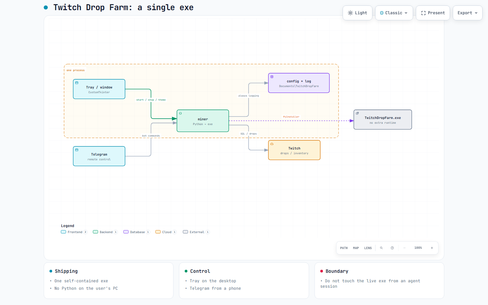

[Українська](README.md) · [English](README.en.md) · [Español](README.es.md) · [Português](README.pt.md) · [Deutsch](README.de.md) · **Français** · [Polski](README.pl.md) · [Türkçe](README.tr.md) · [简体中文](README.zh.md)

# TwitchDropFarm



Schéma interactif : [ouvrir dans le navigateur](https://riasj1dar.github.io/TwitchDropFarm/architecture.en.html) (GitHub affiche le code, pas la page).


Farmez les **timed drops** sur Twitch sans navigateur ouvert ni stream à l'écran.
Le programme lit lui-même votre inventaire, décide de ce qui vaut la peine d'être
farmé, trouve une chaîne appropriée et livre du temps de visionnage à Twitch —
puis affiche les récompenses récupérées dans sa fenêtre, dans la zone de
notification et sur Telegram.

Un binaire par plateforme (Windows `.exe`, Linux, macOS), sans runtime à côté :
ni Node.js, ni Playwright, ni navigateur embarqué. Connexion via Edge, Chrome ou
Chromium. Mise à jour automatique uniquement pour le `.exe` Windows.

## Ce qu'il fait

- **Prévient quand c'est perdu d'avance** : s'il reste moins de temps que de
  minutes de visionnage encore nécessaires, il le dit à l'avance.
- **Il choisit tout seul.** Quatre modes : par liste de priorité, par échéance la
  plus proche, par meilleur ajustement (pour boucler un maximum de campagnes) ou
  uniquement ce à quoi le compte est lié et où un vrai objet est remis.
- **Surveille jusqu'à 198 chaînes** via PubSub et bascule quand un stream
  s'arrête.
- **Récupère les drops automatiquement** et passe aussitôt au suivant.
- **Une fenêtre** à quatre onglets : Minage, Chaînes, Inventaire, Paramètres.
- **Zone de notification** : réduction, notifications, démarrage en arrière-plan.
- **Bot Telegram** : état, inventaire, campagnes, pause/reprise, changement de
  chaîne, gestion des priorités, redémarrage complet — par boutons ou commandes.
- **Encaisse les pannes** : coupure réseau, DNS disparu, mise en veille de
  l'ordinateur, erreurs passagères de Twitch. Au pire, il se relance lui-même.
- **Repère l'immobilisme** : si les minutes cessent de s'accumuler (par exemple
  parce que ce même compte regarde Twitch manuellement ailleurs), il le dit au
  lieu de se taire.
- **Langues de l'interface** (Réglages) : ukrainien par défaut, plus English,
  Español, Português, Deutsch, Français, Polski, Türkçe, 简体中文. Pas de russe.
  Le journal reste en ukrainien. Le bot Telegram utilise la même langue que la
  fenêtre.

## Prérequis

- Windows 10/11 — support complet (fenêtre, barre d’état, `.exe`, démarrage auto, mise à jour auto)
- Linux / macOS — GUI+barre d’état depuis le binaire ou les sources ; démarrage auto manuel ([docs/autostart-linux-macos.md](docs/autostart-linux-macos.md)) ; pas de mise à jour auto
- Python 3.10+ — sources ou construction du binaire
- Edge, Chrome ou Chromium — uniquement pour la première connexion

## Téléchargement (v1.2)

Release : [v1.2](https://github.com/RiasJ1Dar/TwitchDropFarm/releases/tag/v1.2).

| Plateforme | Fichier |
|---|---|
| Windows | [TwitchDropFarm.exe](https://github.com/RiasJ1Dar/TwitchDropFarm/releases/download/v1.2/TwitchDropFarm.exe) (mise à jour auto) |
| Linux x86_64 | [TwitchDropFarm-linux-x86_64](https://github.com/RiasJ1Dar/TwitchDropFarm/releases/download/v1.2/TwitchDropFarm-linux-x86_64) |
| macOS | [TwitchDropFarm-macos](https://github.com/RiasJ1Dar/TwitchDropFarm/releases/download/v1.2/TwitchDropFarm-macos) |

`manifest.json` uniquement pour la mise à jour auto Windows. Pas de mise à jour auto sous Linux/macOS. Démarrage automatique manuel : [docs/autostart-linux-macos.md](docs/autostart-linux-macos.md).

## Lancement

Depuis les sources :

```bash
python -m venv env
env\Scripts\pip install -r requirements.txt
env\Scripts\python main.py
```

Le `.exe` compilé :

```bash
dist\TwitchDropFarm.exe
```

Au premier démarrage, le programme ouvre une page Twitch avec un code de
confirmation. Une fois connecté, le jeton est enregistré et n'est plus jamais
demandé.

### Arguments

| Argument | Effet |
|---|---|
| `--console` | sans fenêtre, console seule — pour un serveur ou le démarrage automatique |
| `--tray` | démarrer réduit dans la zone de notification |
| `--log` | écrire le journal même s'il est désactivé dans les réglages |
| `-v`, `-vv`, `-vvv` | plus de détails dans les journaux (répétable) |
| `--auth-only` | s'authentifier puis quitter |
| `--dump-inventory` | afficher toutes les campagnes et drops, puis quitter |
| `--export` | enregistrer l'historique et l'inventaire en CSV et HTML dans le dossier d'état, puis quitter |
| `--probe-protocol` | vérifier que Twitch accepte encore les requêtes du programme, puis quitter |
| `--test-telegram` | envoyer un message de test puis quitter |
| `--version` | version |

## Configuration

`settings.json` se trouve dans le dossier d'état (voir plus bas) et se crée tout
seul au premier démarrage. Modèle :
[`settings.example.json`](settings.example.json).

| Clé | Signification |
|---|---|
| `farm_mode` | `0` — liste de priorité, `1` — échéance la plus proche, `2` — meilleur ajustement, `3` — campagnes liées uniquement |
| `language` | `uk` par défaut ; aussi `en`, `es`, `pt`, `de`, `fr`, `pl`, `tr`, `zh` ; `auto` — langue de Windows. Le bot suit la fenêtre |
| `priority` | jeux par ordre de préférence |
| `exclude` | jeux à ne pas toucher |
| `farm_cosmetics` | accepter les campagnes qui ne donnent que badges et émotes |
| `verify_channel_drops` | vérifier pour chaque chaîne que les drops sont réellement actifs (plus lent, plus fiable) |
| `start_in_tray` | démarrer réduit |
| `tray_notifications` | notifications contextuelles |
| `dark_theme` | thème sombre de la fenêtre |
| `drop_images` | télécharger les images des récompenses et les afficher dans la liste (cache ~6 Mo) |
| `image_size` | taille de l'image dans la liste, 16–96 |
| `inventory_view` | `list` — liste dense, `tiles` — cartes avec grandes images |
| `browser_path` | chemin du navigateur si la détection échoue |
| `proxy` | proxy pour les requêtes |
| `watch_games` | jeux surveillés : notification quand une nouvelle campagne apparaît |
| `autostart` | démarrer avec Windows (l'entrée est rétablie si elle disparaît du registre) |
| `check_updates` | demander à GitHub, une fois par démarrage, s'il existe des fichiers plus récents |
| `skip_hopeless` | ignorer les campagnes où plus aucun drop ne peut être obtenu avant la fin |
| `progress_style` | `rainbow` — barre de progression irisée, `state` — couleur selon l'état |
| `theme_preset` | jeu de couleurs : vide — intégré, `ocean`, `forest`, `ember`, `grape`, `mono` |
| `keep_log` | tenir un journal (activé par défaut) |
| `log_dir` | dossier du journal ; vide — `Documents\TwitchDropFarm` |
| `hint_links` | signaler les campagnes qui exigent de lier le compte (pour les jeux de `priority` et `watch_games`) |
| `discord_webhook` | adresse du webhook Discord pour les événements importants (récompenses, blocage, liaison perdue, erreurs) ; vide — désactivé |

Le mode et la priorité se changent plus commodément dans l'onglet des
paramètres ; le reste à la main dans le fichier. Les modifications du fichier
prennent effet après un redémarrage.

### Telegram

1. Créez un bot via [@BotFather](https://t.me/BotFather) et récupérez le jeton.
2. Écrivez n'importe quoi à votre bot pour qu'il voie votre `chat_id`.
3. Dans `settings.json` :

```json
"telegram": {
    "enabled": true,
    "bot_token": "VOTRE_JETON_ICI",
    "chat_ids": [VOTRE_CHAT_ID],
    "allow_control": true,
    "notify_critical": true,
    "notify_rewards": true,
    "notify_routine": false,
    "report_every_hours": 6
}
```

4. Vérifiez : `main.py --test-telegram`

`chat_ids` est une liste blanche. Tout ce qui vient d'ailleurs est ignoré : un
inconnu qui trouverait le bot ne pourra pas piloter le miner.

Commandes : `/status`, `/inventory`, `/campaigns`, `/pause`, `/resume`,
`/switch <chaîne>`, `/priority add|remove <jeu>`, `/reload`, `/hide`, `/show`, `/reboot`,
`/watch add|remove <jeu>`, `/report [jours]`, `/export`, `/update`, `/menu`, `/help`.
`/report` résume les 90 derniers jours (de 1 à 365), `/update` installe une mise à jour trouvée.
La plupart des commandes existent aussi sous forme de boutons dans `/menu`.

## Où vit l'état

`%LOCALAPPDATA%\TwitchDropFarm\`

```
auth.json        jeton Twitch
cookies.jar      cookies
settings.json    configuration
history.jsonl    historique des drops (pour /report et l'export)
seen-campaigns.json  campagnes déjà vues (pour watch_games)
theme.json       thème enregistré depuis la fenêtre
images           cache des images de récompenses
lock.file        garde-fou contre deux copies simultanées
browser_profile  profil de navigateur pour la connexion
```

Le journal est écrit dans `Documents\TwitchDropFarm\log.txt` (ou dans `log_dir`) ; sans dossier
Documents, dans le dossier d'état. L'export (`--export`, `/export`) écrit `history.csv`,
`history.html`, `inventory.csv` et `inventory.html` dans le dossier d'état.

Le dossier d'état est unique par utilisateur plutôt que posé à côté du
programme — sinon chaque nouvelle copie redemanderait une connexion. Pour
l'inverse (clé USB, ordinateur d'autrui), placez un fichier vide `portable.txt`
à côté du `.exe` : l'état vivra alors là.

## Compilation

```bash
env\Scripts\python.exe -m PyInstaller build.spec --noconfirm
```

Trois pièges faciles :

- **Arrêtez le `.exe` en cours** avant de compiler, sinon `PermissionError`.
- **N'interrompez pas la compilation.** Un PyInstaller avorté laisse un `.exe`
  tronqué qui meurt sur `DLL load failed while importing _tkinter`. Cela
  ressemble à un défaut du code, mais n'en est pas un.
- **N'ajoutez pas `--clean`** sans raison — plus lent, sans bénéfice.

## Vérifications

```bash
main.py --dump-inventory     toutes les campagnes du Twitch réel
main.py --test-telegram      le bot
tests\core_check.py          logique du cœur (sans réseau)
tests\bot_check.py           tests du bot (sans réseau)
tests\live_check.py          le cœur face au Twitch réel
```

## Comment c'est agencé

```
core/protocol   faits sur l'API privée de Twitch — pas nos décisions
core/config     chemins, intervalles, limites
core/toolbox    outils indépendants
core/api        réseau, reprises, robustesse
core/identity   jeton et en-têtes
core/model      campagnes et drops
core/channels   chaînes et livraison du visionnage
core/pubsub     abonnements
core/miner      uniquement la logique de décision
auth/           connexion : device flow et pilotage du navigateur via CDP
gui/            fenêtre et zone de notification
notify/         Telegram
```

La séparation est délibérée : `protocol` décrit ce que Twitch impose (empreintes
des persisted queries GraphQL, format de l'événement `minute-watched`, noms des
topics), tandis que `config` contient ce que nous avons décidé. Les mélanger,
c'est ne plus savoir lequel des deux on a le droit de changer.

Le pilotage du navigateur est un client maison du Chrome DevTools Protocol
au-dessus d'`aiohttp`. Playwright et Selenium sont écartés sciemment : tous deux
traînent leurs propres environnements d'exécution, alors que l'exigence du projet
est un `.exe` unique et autonome.

## Limites

- Windows uniquement. Rien dans l'architecture n'empêche un portage, mais les
  chemins de navigateur, la zone de notification et le démarrage automatique sont
  écrits pour Windows.
- Twitch ne promet pas que son API privée reste en place. Si les empreintes des
  persisted queries changent, c'est `core/protocol.py` qu'il faudra réparer.
- Un compte par processus.

## Avertissement

Le programme fait ce que ferait un stream ouvert dans un navigateur — simplement
sans personne devant l'écran. Automatiser le visionnage peut entrer en conflit
avec les Conditions d'utilisation de Twitch. Le risque incombe à l'utilisateur ;
l'auteur n'assume aucune responsabilité quant aux conséquences pour votre compte.

## Licence

MIT — voir [LICENSE](LICENSE).
