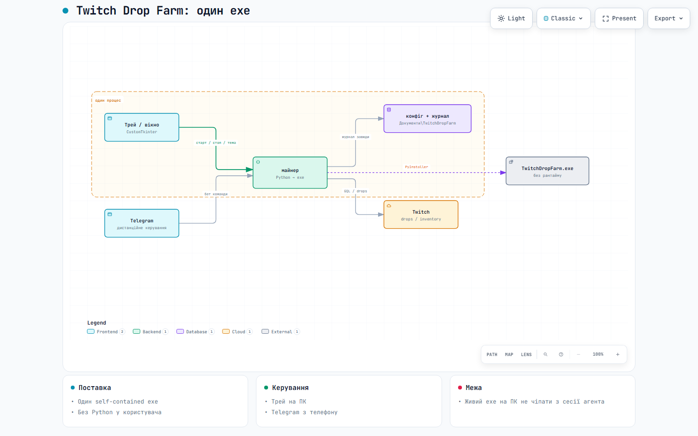

**Українська** · [English](README.en.md) · [Español](README.es.md) · [Português](README.pt.md) · [Deutsch](README.de.md) · [Français](README.fr.md) · [Polski](README.pl.md) · [Türkçe](README.tr.md) · [简体中文](README.zh.md)

# TwitchDropFarm



Інтерактивна схема: [відкрити в браузері](https://riasj1dar.github.io/TwitchDropFarm/architecture.html) (на GitHub файл показує код, не сторінку).

Фарм **timed drops** на Twitch без відкритого браузера й без стріму на екрані.
Програма сама читає інвентар, обирає, що вигідніше фармити, знаходить придатний
канал і доставляє Twitch перегляд — а забрані нагороди показує у вікні, в треї
й у Telegram.

Один бінарник на платформу (Windows `.exe`, Linux, macOS), ніяких рантаймів
поруч: ні Node.js, ні Playwright, ні окремого браузера в комплекті. Для входу
використовується той браузер, який уже стоїть у системі (Edge, Chrome або
Chromium). Автооновлення — лише для Windows `.exe`.

## Що вміє

- **Попереджає, коли не встигне**: якщо до кінця кампанії лишилось менше часу, ніж потрібно хвилин перегляду, скаже про це заздалегідь.
- **Обирає сама.** Чотири режими: за списком пріоритету, за найближчим
  дедлайном, за найщільнішим збігом (щоб устигнути якнайбільше) або лише те, до
  чого акаунт прив'язаний і де дають справжній предмет.
- **Тримає до 198 каналів під наглядом** через PubSub і перемикається, коли
  стрім гасне.
- **Забирає дропи автоматично** й одразу переходить до наступного.
- **Вікно** з чотирма вкладками: Майнінг, Канали, Інвентар, Налаштування.
- **Трей**: згортання, сповіщення; автозапуск разом із системою — на Windows
  з GUI, на Linux/macOS вручну ([docs/autostart-linux-macos.md](docs/autostart-linux-macos.md)).
- **Telegram-бот**: стан, інвентар, кампанії, пауза/продовження, перемикання
  каналу, керування пріоритетом, повний перезапуск — кнопками або командами.
- **Переживає збої**: обрив мережі, зникнення DNS, сон комп'ютера, транзиторні
  помилки Twitch. У крайньому разі перезапускає сама себе.
- **Помічає застій**: якщо хвилини перестали капати (наприклад, цим же акаунтом
  хтось дивиться Twitch вручну) — скаже про це, а не мовчатиме.
- **Мови інтерфейсу** (Налаштування): українська за замовчуванням, також
  English, Español, Português, Deutsch, Français, Polski, Türkçe, 简体中文.
  Російської немає. Журнал лишається українською. Telegram-бот — тією ж мовою,
  що й вікно.

## Вимоги

- Windows 10/11 — повна підтримка (вікно, трей, `.exe`, автозапуск, автооновлення)
- Linux / macOS — GUI+трей з бінарника або з вихідників; автозапуск вручну
  (див. [docs/autostart-linux-macos.md](docs/autostart-linux-macos.md)); без автооновлення
- Python 3.10+ — щоб запускати з вихідників або збирати бінарник
- Edge, Chrome або Chromium — лише для першого входу

## Завантаження (v1.2)

Реліз: [v1.2](https://github.com/RiasJ1Dar/TwitchDropFarm/releases/tag/v1.2).

| Платформа | Файл |
|---|---|
| Windows | [TwitchDropFarm.exe](https://github.com/RiasJ1Dar/TwitchDropFarm/releases/download/v1.2/TwitchDropFarm.exe) (автооновлення) |
| Linux x86_64 | [TwitchDropFarm-linux-x86_64](https://github.com/RiasJ1Dar/TwitchDropFarm/releases/download/v1.2/TwitchDropFarm-linux-x86_64) |
| macOS | [TwitchDropFarm-macos](https://github.com/RiasJ1Dar/TwitchDropFarm/releases/download/v1.2/TwitchDropFarm-macos) (архітектура CI, зараз Apple Silicon) |

`manifest.json` у релізі — лише для автооновлення Windows; його не треба качати вручну.
Linux/macOS без автооновлення. На macOS перший запуск непідписаного бінарника —
через «Відкрити» в Finder (Gatekeeper).

## Запуск

З вихідників:

```bash
python -m venv env
env\Scripts\pip install -r requirements.txt
env\Scripts\python main.py
```

Зібраний бінарник (локальна збірка або з релізу):

```bash
# Windows
TwitchDropFarm.exe
# Linux
chmod +x TwitchDropFarm-linux-x86_64 && ./TwitchDropFarm-linux-x86_64
# macOS
chmod +x TwitchDropFarm-macos && ./TwitchDropFarm-macos
```

При першому запуску програма відкриє сторінку Twitch із кодом підтвердження.
Після входу токен зберігається й більше не питається.

### Аргументи

| Аргумент | Що робить |
|---|---|
| `--console` | без вікна, лише консоль — для сервера чи автозапуску |
| `--tray` | стартувати згорнутим у трей |
| `--log` | писати `log.txt` |
| `-v`, `-vv`, `-vvv` | більше подробиць у логах (можна повторювати) |
| `--auth-only` | лише авторизуватись і вийти |
| `--dump-inventory` | показати всі кампанії та дропи і вийти |
| `--test-telegram` | надіслати тестове повідомлення і вийти |
| `--version` | версія |

## Налаштування

Файл `settings.json` лежить у теці стану (див. нижче) і створюється сам при
першому запуску. Зразок — [`settings.example.json`](settings.example.json).

| Ключ | Значення |
|---|---|
| `farm_mode` | `0` — за списком пріоритету, `1` — найближчий дедлайн, `2` — найщільніший збіг, `3` — лише прив'язані кампанії |
| `language` | `uk` типово; також `en`, `es`, `pt`, `de`, `fr`, `pl`, `tr`, `zh`; `auto` — мова Windows. Бот тією ж мовою, що й вікно |
| `priority` | список ігор у порядку переваги |
| `exclude` | ігри, які не чіпати |
| `farm_cosmetics` | брати кампанії, де дають лише значки та емоції |
| `verify_channel_drops` | перевіряти в кожного каналу, чи справді ввімкнені drops (повільніше, надійніше) |
| `start_in_tray` | стартувати згорнутим |
| `tray_notifications` | спливні сповіщення |
| `dark_theme` | темна тема вікна |
| `drop_images` | завантажувати картинки нагород і показувати їх у списку (кеш ~6 МБ) |
| `image_size` | розмір картинки в списку, 16–96 |
| `inventory_view` | `list` — щільний список, `tiles` — плитки з великими картинками |
| `browser_path` | шлях до браузера, якщо автопошук не знайшов |
| `proxy` | проксі для запитів |

Режим і пріоритет зручніше міняти на вкладці «Налаштування» — решту руками
у файлі. Зміни у файлі діють після перезапуску.

### Telegram

1. Створити бота в [@BotFather](https://t.me/BotFather), забрати токен.
2. Написати своєму боту будь-що, щоб він побачив ваш `chat_id`.
3. У `settings.json`:

```json
"telegram": {
    "enabled": true,
    "bot_token": "СЮДИ_ТОКЕН",
    "chat_ids": [ВАШ_CHAT_ID],
    "allow_control": true,
    "notify_critical": true,
    "notify_rewards": true,
    "notify_routine": false,
    "report_every_hours": 6
}
```

4. Перевірити: `main.py --test-telegram`

`chat_ids` — це білий список. Усе, що прийшло не звідти, ігнорується, тож
чужий, хто знайде бота, керувати майнером не зможе.

Команди: `/status`, `/inventory`, `/campaigns`, `/pause`, `/resume`,
`/switch <канал>`, `/priority add|remove <гра>`, `/reload`, `/hide`, `/show`, `/reboot`,
`/menu`, `/help`. Усе, крім двох останніх із аргументами, доступне кнопками.

## Де лежить стан

- Windows: `%LOCALAPPDATA%\TwitchDropFarm\`
- macOS: `~/Library/Application Support/TwitchDropFarm/`
- Linux: `$XDG_STATE_HOME/TwitchDropFarm/` або `~/.local/state/TwitchDropFarm/`

```
auth.json        токен Twitch
cookies.jar      cookie
settings.json    налаштування
log.txt          журнал (з --log)
lock.file        захист від двох копій одночасно
browser_profile  профіль браузера для входу
```

Тека стану одна на користувача, а не поруч із програмою — інакше кожна нова
копія просила б вхід заново. Щоб зробити навпаки (флешка, чужий комп'ютер),
покладіть порожній файл `portable.txt` поруч із бінарником: тоді стан житиме там.

## Збірка

```bash
python -m PyInstaller build.spec --noconfirm
```

На Windows зручно через venv: `env\Scripts\python.exe -m PyInstaller …`.
Релізний CI збирає три артефакти: `TwitchDropFarm.exe`, `TwitchDropFarm-linux-x86_64`,
`TwitchDropFarm-macos`.

Три речі, на яких легко обпектися:

- **Зупиніть запущений бінарник** перед збіркою, інакше `PermissionError` (Windows).
- **Не переривайте збірку.** Обірваний PyInstaller лишає обрізаний файл, який
  падає з `DLL load failed while importing _tkinter`. Виглядає як дефект коду,
  але ним не є.
- **Не додавайте `--clean`** без потреби — довше й без користі.

## Перевірки

```bash
main.py --dump-inventory     усі кампанії з живого Twitch
main.py --test-telegram      бот
tests\core_check.py          логіка ядра (без мережі)
tests\bot_check.py           тести бота (без мережі)
tests\live_check.py          ядро проти живого Twitch
```

## Як воно влаштоване

```
core/protocol   факти про приватний API Twitch — не наші рішення
core/config     шляхи, інтервали, межі
core/toolbox    незалежні інструменти
core/api        мережа, повтори, живучість
core/identity   токен і заголовки
core/model      кампанії та дропи
core/channels   канали й доставка перегляду
core/pubsub     підписки
core/miner      тільки логіка рішень
auth/           вхід: device flow і керування браузером через CDP
gui/            вікно і трей
notify/         Telegram
```

Поділ навмисний: `protocol` описує те, що диктує Twitch (хеші persisted-запитів
GraphQL, формат події `minute-watched`, назви топіків), `config` — те, що
вирішили ми. Змішувати їх означає не розуміти, що з цього можна змінювати.

Керування браузером зроблене власним клієнтом Chrome DevTools Protocol поверх
`aiohttp`. Playwright і Selenium свідомо не використовуються: обидва тягнуть
власні рантайми, а вимога проєкту — один самодостатній бінарник на платформу.

## Обмеження

- Автозапуск з GUI — лише Windows. Linux/macOS: GUI+трей з бінарника v1.2;
  автозапуск вручну — [docs/autostart-linux-macos.md](docs/autostart-linux-macos.md);
  автооновлення немає.
- Snap Chromium на Linux часто не стартує з нашим `--user-data-dir`. Краще
  Google Chrome, пакетний (не-snap) Chromium або явний `browser_path`.
- Twitch не гарантує, що приватний API лишиться незмінним. Якщо хеші
  persisted-запитів зміняться, лагодити доведеться `core/protocol.py`.
- Один акаунт на процес.

## Застереження

Програма робить те саме, що робив би відкритий у браузері стрім, — але без
людини перед екраном. Автоматизація перегляду може суперечити умовам
використання Twitch. Ризик — на користувачеві; автор відповідальності за
наслідки для акаунта не несе.

## Ліцензія

MIT — [LICENSE](LICENSE), переклад українською: [LICENSE.uk.md](LICENSE.uk.md).
